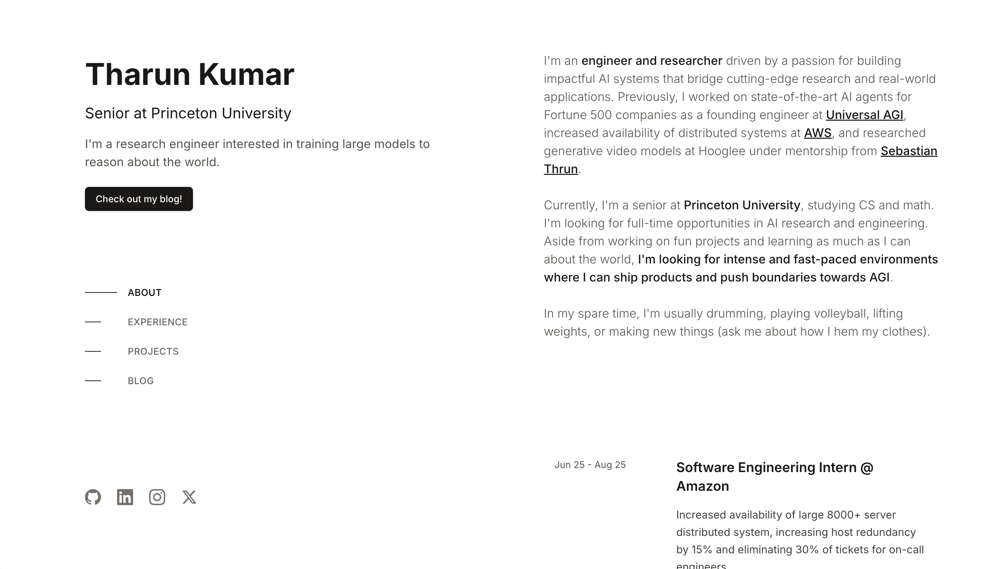
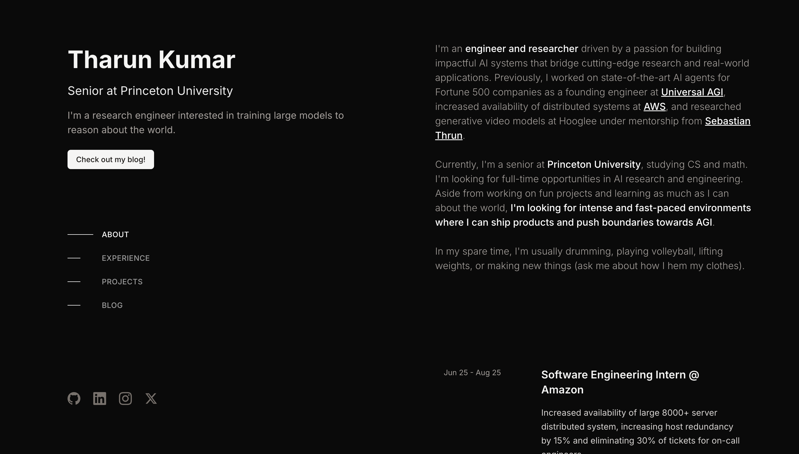

<h1 align="center">
  tharunkumar.xyz
</h1>
<p align="center">
  A modern, responsive personal website with blog built with <a href="https://nextjs.org/" target="_blank">Next.js</a> and <a href="https://www.typescriptlang.org/" target="_blank">TypeScript</a>
</p>

Light mode:



Dark mode:




## Development setup

1. Install dependencies

   ```sh
   npm install
   ```

2. Start the development server

   ```sh
   npm run dev
   ```

3. Open [http://localhost:3000](http://localhost:3000) with your browser to see the result

## Building and Running for Production

1. Generate a full static production build

   ```sh
   npm run build
   ```

2. Start the production server

   ```sh
   npm start
   ```


## Tech Stack

- **Framework**: Next.js 15 with App Router
- **Language**: TypeScript
- **Styling**: Tailwind CSS
- **Content**: Markdown with gray-matter frontmatter parsing
- **Syntax Highlighting**: highlight.js with rehype-highlight
- **Themes**: next-themes for dark/light mode

## Content Management

- **Blog Posts**: Add markdown files to `content/blog/`
- **Projects**: Add project details to `content/projects/`
- **Work Experience**: Update work history in `content/work/`

Each content type supports frontmatter for metadata and full markdown syntax for content.
